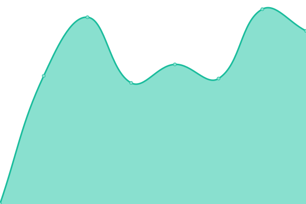
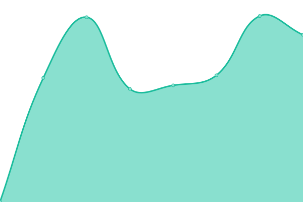
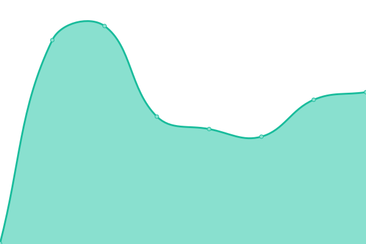

# [📈 Live Status](https://demo.upptime.js.org): <!--live status--> **🟩 All systems operational**

This repository contains the open-source uptime monitor and status page for [Upptime](https://upptime.js.org), powered by [Upptime](https://github.com/upptime/upptime).

With [Upptime](https://upptime.js.org), you can get your own unlimited and free uptime monitor and status page, powered entirely by a GitHub repository. We use [Issues](https://github.com/upptime/upptime/issues) as incident reports, [Actions](https://github.com/alex602022/upptime/actions) as uptime monitors, and [Pages](https://demo.upptime.js.org) for the status page.

<!--start: status pages-->
<!-- This summary is generated by Upptime (https://github.com/upptime/upptime) -->
<!-- Do not edit this manually, your changes will be overwritten -->
<!-- prettier-ignore -->
| URL | Status | History | Response Time | Uptime |
| --- | ------ | ------- | ------------- | ------ |
|  [onmid](https://onmid.net) | 🟩 Up | [onmid.yml](https://github.com/alex602022/upptime/commits/HEAD/history/onmid.yml) | 

 414ms
     
 | 

<a href="https://alex602022.github.io/upptime/history/onmid">100.00%</a>
    

|  [my nav](https://nav.onmid.net) | 🟩 Up | [my-nav.yml](https://github.com/alex602022/upptime/commits/HEAD/history/my-nav.yml) | 

 1209ms
     
 | 

<a href="https://alex602022.github.io/upptime/history/my-nav">100.00%</a>
    

|  [my web3 nav](https://wnav.onmid.net) | 🟩 Up | [my-web3-nav.yml](https://github.com/alex602022/upptime/commits/HEAD/history/my-web3-nav.yml) | 

 880ms
     
 | 

<a href="https://alex602022.github.io/upptime/history/my-web3-nav">100.00%</a>
    

|  [chat](https://chat.onmid.net) | 🟩 Up | [chat.yml](https://github.com/alex602022/upptime/commits/HEAD/history/chat.yml) | 

 671ms
     
 | 

<a href="https://alex602022.github.io/upptime/history/chat">100.00%</a>
    

|  [wiki](http://43.142.236.225:890/) | 🟩 Up | [wiki.yml](https://github.com/alex602022/upptime/commits/HEAD/history/wiki.yml) | 

 7875ms
     
 | 

<a href="https://alex602022.github.io/upptime/history/wiki">99.83%</a>
    

|  [onmid.montaigne.io](https://onmid.montaigne.io/) | 🟩 Up | [onmid-montaigne-io.yml](https://github.com/alex602022/upptime/commits/HEAD/history/onmid-montaigne-io.yml) | 

 322ms
     
 | 

<a href="https://alex602022.github.io/upptime/history/onmid-montaigne-io">100.00%</a>
    

<!--end: status pages-->

[**Visit our status website →**](https://demo.upptime.js.org)

## 📄 License

- Powered by: [Upptime](https://github.com/upptime/upptime)
- Code: [MIT](./LICENSE) © [Upptime](https://upptime.js.org)
- Data in the `./history` directory: [Open Database License](https://opendatacommons.org/licenses/odbl/1-0/)
